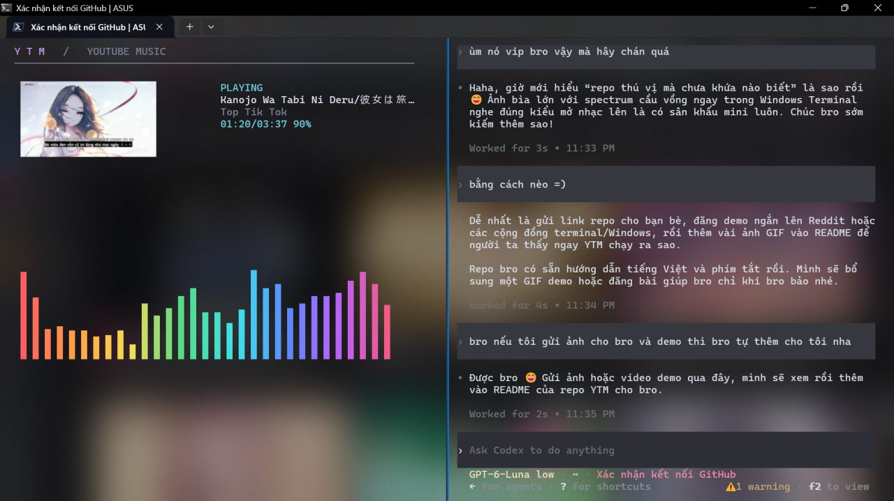

# YTM

A YouTube music player inside Windows Terminal. Large artwork, a real audio
spectrum with an animated rainbow, and playlists you can manage from the keyboard.

Built with Go, Bubble Tea, mpv, yt-dlp and CAVA. Windows 10/11 is the supported
platform; the current source does not build for Linux or macOS.

Want to listen to music in your terminal like on Linux, without the setup and
customization? YTM is a great choice. One PowerShell command gets you this
eye-catching interface.



## What it does

- Search YouTube or open a YouTube / YouTube Music video URL.
- Play, pause, seek, adjust volume, skip tracks and advance automatically.
- Create, rename and delete playlists; reorder tracks.
- Move, copy or delete multiple selected tracks.
- Shuffle and repeat one track or the entire playback queue.
- Show high-resolution thumbnails with Sixel or true-color half-block fallback.
- Display a real CAVA/WASAPI spectrum, with spectrum and mirror styles.

The playlist you browse is independent of the queue currently playing.
Editing a playlist does not interrupt audio. Press Enter on a track to start a
new playback queue using that playlist's current order.

## Install on Windows

### Quick install (one command)

Open Windows Terminal / PowerShell and paste:

```powershell
irm https://raw.githubusercontent.com/jkvhvjhkjhx/ytm/main/install-ytm.ps1 | iex
```

The installer sets up Scoop and Git for your Windows account if needed, installs
mpv, yt-dlp, Deno and CAVA, verifies the YTM release checksum, and adds `ytm` to your
user PATH. It does not require administrator rights for Scoop; WinGet may ask
for confirmation when installing CAVA. Close and reopen the terminal after it
finishes, then run `ytm`. The command requires WinGet (App Installer) and an
internet connection.

No GitHub account is needed. Downloads retry automatically. If installation
fails, the installer names the failing step and prints its log path under
`%LOCALAPPDATA%\ytm\logs\install-*.log`. Close YTM before reinstalling it.

The same installer is available as a file from the repository:
[install-ytm.ps1](install-ytm.ps1).

### 1. Install dependencies

Use a recent Windows Terminal and install [Scoop](https://scoop.sh/) if you do
not already have it. In PowerShell:

```powershell
scoop bucket add extras
scoop install mpv yt-dlp deno
winget install --id karlstav.cava -e
```

Use an up-to-date yt-dlp and Deno. The official yt-dlp executable includes
yt-dlp-ejs; see the [upstream EJS setup guide](https://github.com/yt-dlp/yt-dlp/wiki/EJS).
YTM also allows yt-dlp to fetch its EJS component from GitHub.

### 2. Get YTM

If you prefer manual installation, download the Windows release ZIP from this
repository's **Releases** and extract it.
From the extracted folder:

```powershell
powershell -NoProfile -ExecutionPolicy Bypass -File .\install.ps1
```

Close and reopen PowerShell, then:

```powershell
ytm --doctor
ytm
```

Alternatively, run `./ytm.exe` directly from the extracted folder.
The installer uses your user account and installs into
`%LOCALAPPDATA%\Programs\ytm`.

### Build from source

Install the [Go toolchain](https://go.dev/dl/) required by `go.mod`, then run
these commands from the repository folder:

```powershell
go mod download
go test -buildvcs=false ./...
go build -buildvcs=false -o ytm.exe .
.\ytm.exe
```

Build a release ZIP with `./package.ps1`. Output goes into `dist/`, including
SHA256 checksums and license notices for Go dependencies.

## Keyboard guide

Press **t** in normal mode for the help overlay. Press **t** or **Esc** to close it.
Letters below are case-sensitive unless both cases are listed.

| Context | Key | Action |
| --- | --- | --- |
| Normal mode | / | Open search editor |
| Search editor | Enter / Esc | Search / close editor |
| Search editor | Ctrl+C / Ctrl+X / Ctrl+V | Copy / cut / paste |
| Search editor | Ctrl+A; arrows; Home/End | Select all / move caret |
| Results or tracks | j / k | Move selection down / up |
| Results or tracks | Enter | Play selected track |
| Normal mode | Tab | Switch results / playlist focus |
| Normal mode | Space | Pause / resume |
| Normal mode | n / p | Next / previous track |
| Normal mode | s | Stop |
| Normal mode | Left / Right | Seek backward / forward five seconds |
| Normal mode | Up / Down | Volume up / down |
| Normal mode | h or H | Toggle shuffle |
| Normal mode | r or R | Repeat off → playlist → one |
| Normal mode | v | Spectrum / mirror |
| Normal mode | q or Ctrl+C | Quit |
| Normal mode | Ctrl+N | Create playlist |
| Playlist browser | Enter | Open selected playlist |
| Tracks | Backspace / Esc | Return to playlist browser |
| Playlist area | F2 | Rename selected/open playlist |
| Playlist area | Ctrl+D | Confirm deletion of selected/open playlist |
| Playlist browser | Delete | Confirm playlist deletion |
| Tracks | d, D or Delete | Enter track deletion selection |
| Tracks | m / Shift+M | Enter Move / Copy selection |
| Tracks | Shift+J / Shift+K or Alt+Down/Up | Reorder track |
| Tracks | Shift+C | Clear viewed playlist |
| Normal mode | a | Add selected search result to playlist |
| Track selection | j/k, J/K or Up/Down | Navigate tracks |
| Track selection | Space | Tick / untick |
| Track selection | Ctrl+A / Ctrl+D | Select all / clear selection |
| Move/Copy selection | Enter | Choose destination or create a playlist |
| Delete selection | Enter | Delete selected tracks and save |
| Track selection | Esc | Cancel |
| Destination picker | Enter / Esc | Confirm / return, keeping selection |
| Playlist delete confirmation | Enter or y / Esc or n | Confirm / cancel |

**Ctrl+D is contextual:** it deletes a playlist in normal playlist navigation,
and clears ticks while selecting tracks. Player shortcuts do not fire through
the selection dialogs. Shuffle and repeat start OFF after a restart.

## Storage and settings

- Settings: `%APPDATA%\ytm\config.toml`; see [config.example.toml](config.example.toml).
- Playlists: `%APPDATA%\ytm\playlist.json`.
- Audio cache: `%LOCALAPPDATA%\ytm\cache`.
- Artwork: `%LOCALAPPDATA%\ytm\artwork`.
- Logs: `%LOCALAPPDATA%\ytm\logs`.

You can set explicit paths for mpv, yt-dlp, CAVA and Deno in the configuration
if automatic discovery fails. Playlist metadata stores video URLs, not temporary
audio stream URLs.

## Current limitations

- Audio is downloaded completely before playback; an uncached track can take
  time to start. Download limit: 128 MiB per track, three-minute timeout.
- Live streams are excluded. The audio cache targets approximately 256 MiB.
- CAVA observes the default Windows output device, including other apps' audio.
- Automatic Sixel detection currently recognizes a Scoop Windows Terminal
  installation. Other installations fall back to half-block artwork; set
  `image_mode = "sixel"` only if your terminal supports it.
- Use a terminal around 110 × 32 or larger. The minimum useful size is 38 × 16.
- YouTube changes can require updating yt-dlp. Playback availability also depends
  on the video, network and region.

## Troubleshooting and contributing

Run `ytm --doctor` first. For an extraction issue, update yt-dlp and Deno.
If stable yt-dlp still fails, consult
[yt-dlp's update instructions](https://github.com/yt-dlp/yt-dlp#update).

`ytm --self-check "Daft Punk Get Lucky"` runs a real integration check and
**plays audible music**. It exercises search, artwork, mpv, CAVA, transport,
playlists, transfer and restarting mpv. Automated CI runs local tests only.

When opening an issue, include your Windows/Terminal versions, YTM version,
dependency versions and steps to reproduce. Review logs for personal information
before posting them.

See [CONTRIBUTING.md](CONTRIBUTING.md) for development checks and
[THIRD-PARTY.md](THIRD-PARTY.md) for upstream projects.

## Tiếng Việt

Cài dependency ở bước 1, giải nén bản Windows rồi chạy `install.ps1`.
Mở PowerShell mới, gõ `ytm`. Nhấn `/` để tìm nhạc, `Tab` để chuyển focus,
`j/k` để chọn bài và `Enter` để phát. Nhấn `t` để xem hướng dẫn phím.
Đổi playlist đang xem không ngắt bài đang phát.

## License

[MIT](LICENSE). External programs and Go dependencies retain their own licenses;
see [THIRD-PARTY.md](THIRD-PARTY.md).
